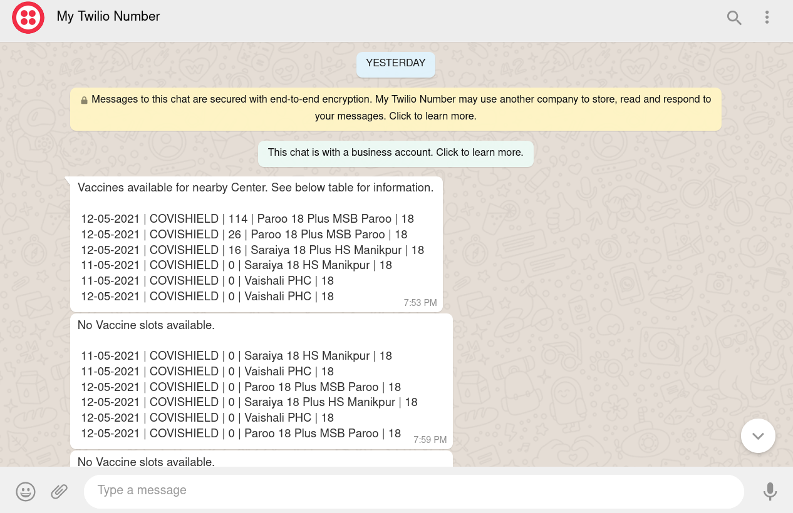

# CoWIN-slot-availability 

A small python script to check Vaccine slot and notify using WhatsApp.



# Execute

First set up the time interval at which you want to run the script interatively; currently set at 10 seconds.

Run the script using

```python
python vaccine.py
```

This script send messages at hourly intervals untill the vaccine slot is found.

## Dependencies

### Install individually using:

1. Twilio:    ```pip install twilio ```
2. CoWIN API:  ```pip install cowin ```
3. dotenv:  ```pip install python-dotenv ```

or

### Install all dependencies using:

```python
pip install -r requirements.txt
```


## Twilio environmental variables

Setup a .env file in the same directory which would consist of various required environment variables required to send WhatsApp Message:

1. ACCOUNT_SID: ``` export ACCOUNT_SID='xxxxxxxxxxxxxxx' ```
2. AUTH_TOKEN: ``` export AUTH_TOKEN='xxxxxxxxxxxxx' ```

3. FROM_WHATSAPP_NUMBER: ```export FROM_WHATSAPP_NUMBER='whatsapp:+91-70612xxxxx' ```

4. FROM_SMS_NUMBER: ```export FROM_SMS_NUMBER='+91-70612xxxxx' ```


Setting these variables will require signing up for Twilio first.


